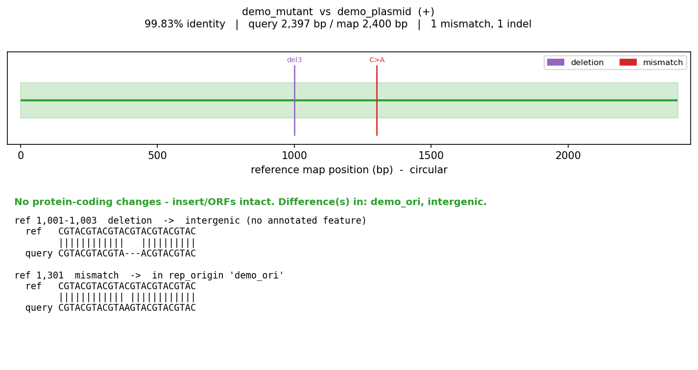
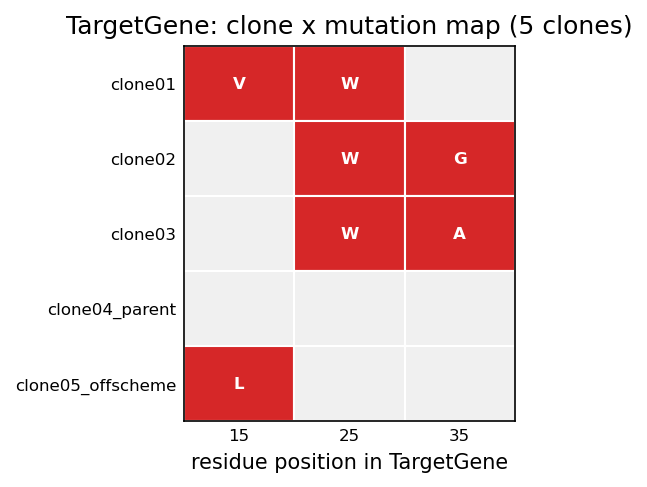

# plasmid-clone-validator

Offline, scriptable sequence-validation for molecular cloning — with a focus on
**genetic code expansion (GCE) / directed-evolution** campaigns.

Three small Python scripts that read your plasmid maps and sequencing results,
call variants, translate the affected genes, and write figures + summaries.
Everything runs **locally** — no account, no upload, no subscription.

- **`compare_plasmid.py`** — compare a whole assembled plasmid (e.g. a
  Plasmidsaurus consensus) to a reference map. Handles circular plasmids and
  either strand, then classifies each difference (synonymous / missense /
  nonsense / indel, or which backbone element it falls in).
- **`align_sanger.py`** — align short Sanger `.ab1` reads to a region of a map
  (quality-trimmed, both strands, Phred-gated discrepancies).
- **`cloning_report.py`** — protein-level report across many clones of a
  construct: amino-acid variant calls vs a parent and which mutations recur.
  For directed-evolution / genetic-code-expansion (GCE) work it adds an
  amber/stop audit and NNK library QC.
- **`library_profile.py`** — profile a **combinatorial chimera library** from
  one pooled Nanopore (Plasmidsaurus) run: for each read it calls which source
  contributed each domain (e.g. `N=Mc | catalytic=Mi | C=Mj`), then reports the
  library-wide composition, per-domain source usage, abundance skew, and
  dropouts. Pure-Python (no aligner) via source-specific k-mers, so it installs
  and runs on Windows. See "Profiling a chimera library" below.

Reads **SnapGene `.dna`** and **GenBank `.gb`/`.gbk`** maps, and **`.ab1` /
`.fasta` / `.gbk`** sequencing results — no format conversion.

> **Honesty by design.** A green "IDENTICAL" verdict is only emitted when the
> analysis actually examined the whole molecule (no soft-clipped ends, full
> coverage, no low-confidence bases). If any region was not examined, the
> verdict is explicitly *qualified* — the tool will not hand you an unearned
> all-clear. Convergence in `cloning_report` is reported as a **hypothesis**, not
> proof of function.

---

## Example output

`compare_plasmid.py` — a whole-plasmid comparison: the verdict, a circular map
with every difference flagged, and the aligned sequence around each one
(here a SNP and a 3 bp deletion, both in non-coding regions):



`cloning_report.py` — a clone × mutation map across a set of clones; a column
lit up across several clones is a recurring (convergent) mutation (here `W` at
residue 25 in three of five clones):



*(Both generated from the bundled synthetic demo data.)*

---

## Getting started for users

### 1. Get the code

**Easiest (no git needed):** on the repo page, click the green **`Code`** button →
**Download ZIP**, then unzip it. (If the repo is private, accept the GitHub
invite first and make sure you're logged in.)

**Or, with git:**

```bash
git clone https://github.com/sanjayramprasad-spec/plasmid-clone-validator.git
cd plasmid-clone-validator
```

(For a private repo, cloning asks you to log in to GitHub the first time — a
plain account password won't work; use the browser prompt, the GitHub CLI
`gh auth login`, or an SSH key.)

### 2. Install Python + the two libraries (one time)

Install **Python 3.9 or newer** (on Windows, tick **"Add Python to PATH"** in
the installer). Then, from inside the project folder:

```
pip install -r requirements.txt
```

That installs `biopython` and `matplotlib` — nothing else, and no internet is
needed when you actually run the tools.

### 3. Try it on the bundled demo data

Everything in `example_test_data/` is a **fabricated demo plasmid**, so you can
run the tools before touching your own data:

```bash
# Whole-plasmid comparison (clean = identical; mutant = 1 SNP + 1 indel)
python compare_plasmid.py example_test_data/demo_plasmid.gb \
    example_test_data/demo_clean.fasta example_test_data/demo_mutant.fasta

# Per-clone protein report: variants, recurrence (+ amber audit / NNK QC for GCE)
python cloning_report.py example_test_data/demo_plasmid.gb \
    example_test_data/demo_clones --config example_test_data/demo_campaign.txt
```

### 4. Run it on your own data

Point the same commands at your own map + results — a single file or a whole
folder. Put quotes around any path that contains spaces. Outputs are written to
a new folder next to your map (see "What you get" below).

## What you get

- **`compare_plasmid.py`** → `comparison_figures/`: a per-query figure + a
  `comparison_summary.txt` with the verdict and every difference (position,
  base change, and biological consequence).
- **`cloning_report.py`** → `cloning_report/`: `clone_variants.csv` (per clone),
  `mutation_matrix.csv` + a heatmap, and `cloning_summary.txt` (unique genotypes +
  convergent mutations).
- **`align_sanger.py`** → `alignment_figures/`: a per-read figure, a combined
  view, and `alignment_summary.txt`.
- **`library_profile.py`** → `library_profile/`: `per_read.tsv`,
  `composition.tsv`, `domain_usage.tsv` + a `domain_usage.png` heatmap and
  `top_genotypes.png`, and a `library_summary.txt` QC report.

## Profiling a chimera library

For a **combinatorial library** — many constructs, each assembled from
interchangeable domain fragments drawn from a panel of source genes (e.g. an
N-terminal, a middle, and a C-terminal domain, each taken from a different
source and fused at conserved junctions) — `library_profile.py` answers "which
source built each domain of each molecule, and how are the combinations
distributed?"

```bash
python library_profile.py sources.fasta reads.fastq --names N,middle,C
```

- **`sources.fasta`** — full-length references, one record per source. They are
  expected to share a backbone and conserved junctions and differ inside the
  domains; the tool aligns them, **auto-detects the domains** as the variable
  blocks between conserved junctions, and learns each source's domain alleles.
- **`reads.fastq`** — one pooled run of all reads (`.fastq`/`.fasta`, or a folder).

**Why no aligner:** a chimera read matches no single reference end-to-end, so a
"best hit" is meaningless. Instead the tool counts k-mers *private to one source
within a domain* — the sources are divergent enough that this classifies every
domain unambiguously even at ~5% Nanopore error. Shared backbone / junction
k-mers are never private, so they never vote. This keeps it **biopython-only**
(no `minimap2`/`mappy`, which do not build on native Windows).

**Honesty gate:** a domain is called only when its top source clears an absolute
marker floor *and* beats the runner-up by a margin; otherwise it is `unassigned`
(a truncated read, or a source **not in your panel**). A read counts toward
composition only if **every** domain is called — partial/ambiguous reads are
reported separately, never silently force-counted.

Options: `--k 15`, `--min-markers 10`, `--margin 3.0`, `--anchor-min 20`,
`--names …`, and `--expected designed_combos.tsv` (a designed-combination list,
one combo per line, for a true coverage-of-design report).

Outputs (in `library_profile/` next to the references):
`per_read.tsv`, `composition.tsv`, `domain_usage.tsv`, a `domain_usage.png`
heatmap, a `top_genotypes.png` bar, and `library_summary.txt` (yields, dropouts,
skew, caveats).

> **Limited by your panel.** With only the source references you provide, each
> domain is resolved to one of *those* sources (or flagged). If the real library
> includes building blocks you didn't supply, reads using them show up as
> `partial`/`unassigned` rather than mis-called — add the missing references to
> resolve them.

## The GCE config file

`cloning_report.py` takes a small plain-text config describing the campaign:

```
gene: TargetGene           # label of the CDS in the map to analyse
randomized: 15, 25, 35     # 1-based residue numbers randomized (NNK)
amber: 40                  # designed amber (TAG) sites, residue numbers
scheme: NNK                # randomization scheme (default NNK)
```

Only `gene` is required. Residue numbers are counted from the first codon of the
named CDS feature in your map. The amber audit assumes **amber (TAG)**
suppression (the GCE standard); opal (TGA) / ochre (TAA) are reported as hard
stops.

## Tests

```
pip install pytest
python -m pytest -q
```

`test_toolkit.py` (synthetic data) covers the known-answer cases plus
completeness-gated verdicts, soft-clip detection, circular (rotation)
invariance, and minus-strand residue numbering. `test_chimera.py` covers the
chimera profiler: domain auto-detection, known-answer mosaic calls, strand
invariance, and the honesty gate (partial / unknown-source reads never count
toward composition).

## Notes & limitations

- A single Sanger read covers ~800–1000 bp — validate long inserts with reads
  from several primers whose coverage overlaps.
- Biological calls are only as good as your map's annotations (CDS features,
  reading frame). Numbering follows the CDS feature's frame.
- The whole-plasmid comparison is validated to ~15 kb (alignment is O(N²) time
  but memory stays flat); larger plasmids work but get slower.
- This is research tooling provided as-is — sanity-check important results.

## License

MIT — see `LICENSE`.
