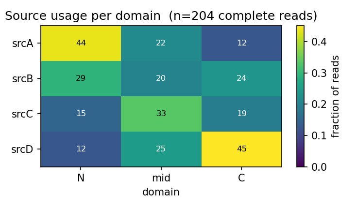
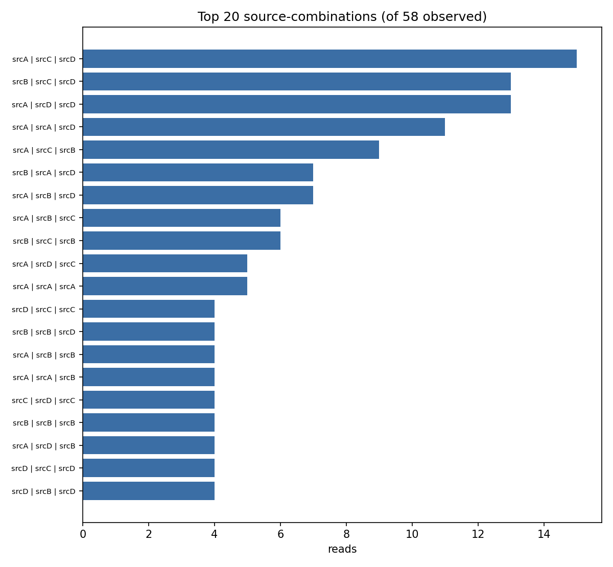

# library-profile

Profile a **combinatorial chimera library** from one pooled long-read run. For
every read, work out which source contributed each domain, then summarise the
whole library: combination composition, per-domain source usage, abundance skew,
and dropouts. Runs **locally**, pure-Python. 

A **chimera library** is a pool of constructs, each assembled from interchangeable
domain fragments drawn from a panel of source genes, each taken from a different source and fused at
conserved junctions. One pooled Nanopore (e.g. Plasmidsaurus) run gives thousands
of reads; per molecule we want the **domain mosaic**—`N=srcA | mid=srcC |
C=srcD`—and then the library-wide picture.

```bash
python library_profile.py sources.fasta reads.fastq --names N,mid,C
```

---

## Why there's no aligner

A chimera read matches **no single** reference end-to-end, so a "best hit" is
meaningless. Instead the tool counts k-mers that are **private to one source
within a domain**: the source alleles are divergent enough (often 20–45%) that
each carries hundreds of unique k-mers, so counting which source's private k-mers
a read contains, per domain, classifies every domain unambiguously even at ~5%
Nanopore error. Shared backbone and conserved-junction k-mers are never private,
so they simply never vote.

The payoff: it stays **biopython-only** and installs and runs on **Windows**,
where `minimap2`/`mappy` do not build.

## Honesty by design

A domain is only called when its top source clears an absolute marker floor **and**
beats the runner-up by a margin; otherwise it is left `unassigned`. A read counts
toward composition only when **every** domain is called, truncated reads, or reads
using a source that isn't in your panel, are reported as `partial`/`ambiguous` and
**never force-counted**. The composition you get is one the data actually supports.

> **Limited by your panel.** Each domain is resolved to one of the sources you
> provide (or flagged). If the real library includes building blocks you didn't
> supply, reads using them show up as `partial` rather than mis-called, add the
> missing source references to resolve them.

---

## Getting started

### 1. Get the code

**Easiest (no git):** on the repo page, click the green **`Code`** button →
**Download ZIP**, then unzip. **Or, with git:**

```bash
git clone https://github.com/sanjayramprasad-spec/library-profile.git
cd library-profile
```

### 2. Install Python + the two libraries (one time)

Install **Python 3.9 or newer** (on Windows, tick **"Add Python to PATH"**). Then,
from inside the project folder:

```bash
pip install -r requirements.txt
```

That installs `biopython` and `matplotlib` , nothing else, and no internet is
needed when you run the tool.

### 3. Try it on the bundled demo data

Everything in `example_data/` is **fully synthetic** (seeded random DNA , not real
biology): four sources sharing a backbone and two conserved junctions, and 240
reads stitched from random source mosaics with planted ~4% errors, mixed strand,
and some truncation.

```bash
python library_profile.py example_data/demo_sources.fasta \
    example_data/demo_reads.fastq --names N,mid,C
```

You should see ~85% of reads resolve to a complete genotype, 58 unique
combinations, and the two figures below in `example_data/demo_reads_profile/`.

### 4. Run it on your own data

Point the same command at your own sources FASTA + reads. Put quotes around any
path with spaces. Outputs land in a `<reads>_profile/` folder next to your reads
file, named after it (e.g. `GS_pKW2-libv6-DH5a.fastq` -> `GS_pKW2-libv6-DH5a_profile/`)
so each results folder traces back to the run it came from, or wherever you point
`--out`.

---

## Example output

`domain_usage.png` how often each source was used at each domain (here the
synthetic demo's planted skew: `srcA` favoured at N, `srcD` at C):



`top_genotypes.png` the most abundant source-combinations across the library:



*(Both generated from the bundled synthetic demo data.)*

---

## Inputs

- **`sources`**  full-length references, **one per source**, as any of:
  a single multi-record **FASTA**; a single **SnapGene `.dna`** or `.fasta`; or a
  **folder** of per-source `.fasta`/`.dna` files (mix allowed). A folder is combined
  into one `<folder>_combined_refs.fasta` beside it, which you can reuse. `.dna`
  sources are named after their file. They are expected to share a backbone and
  conserved junctions and differ inside the domains; the tool aligns them,
  **auto-detects the domains** as the variable blocks between conserved junctions
  (the count is discovered, not assumed), and learns each source's domain alleles.
- **`reads.fastq`**  one pooled run of all reads. `.fastq` or `.fasta` (optionally
  gzipped, `.fastq.gz` / `.fasta.gz`), a single file, several files, or a folder.

## Options

| Option | Default | Meaning |
|---|---|---|
| `--k` | 15 | k-mer length (odd; larger = stricter, fewer hits) |
| `--min-markers` | 10 | absolute private-marker floor to call a domain |
| `--margin` | 3.0 | winner must beat runner-up by this ratio (by marker fraction) |
| `--names` | `dom1,dom2,…` | friendly domain names, in order (comma- or space-separated) |
| `--anchor-min` | 20 | min length of a conserved run treated as a junction |
| `--expected FILE` | — | a designed-combination list (one combo per line) for a true coverage report |
| `--out DIR` | `<reads>_profile/` | output directory (created if needed) |

## Outputs

Written to `<reads>_profile/` next to the reads file (or `--out DIR`):

| File | Contents |
|---|---|
| `per_read.tsv` | one row per read: orientation, per-domain call + hits/fraction, status |
| `composition.tsv` | each observed source-combination and its read share |
| `domain_usage.tsv` | per domain, how often each source allele was used |
| `domain_usage.png` | domain × source usage heatmap |
| `top_genotypes.png` | the most abundant combinations |
| `library_summary.txt` | honesty-gated QC: yields, dropouts, skew, caveats |

## Tests

```bash
pip install pytest
python -m pytest -q
```

`test_library_profile.py` (synthetic data, self-contained) covers domain
auto-detection, known-answer mosaic calls, strand invariance, and the honesty gate
(partial / unknown-source / close-margin reads never count toward composition).

## Notes & limitations

- Read counts are **not** absolute abundances, Nanopore yield is length and
  GC-biased, and shorter molecules load better. Treat composition as relative.
- A combination being present is evidence of **assembly**, not of function.
- Resolution is limited to the sources in your panel (see "Limited by your panel"
  above). Add missing source references to resolve `partial` reads.
- This is research tooling provided as-is sanity-check important results.

## License

MIT — see `LICENSE`.
